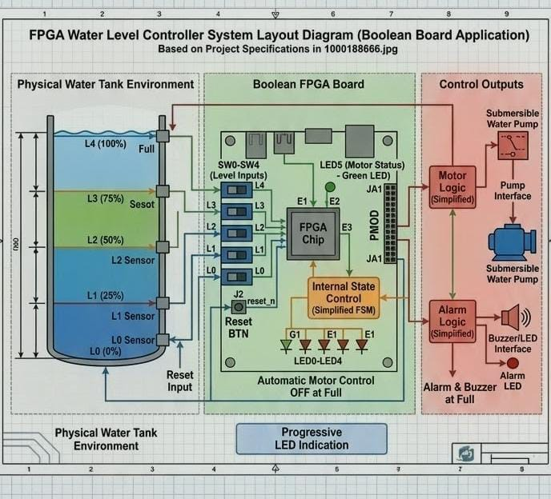
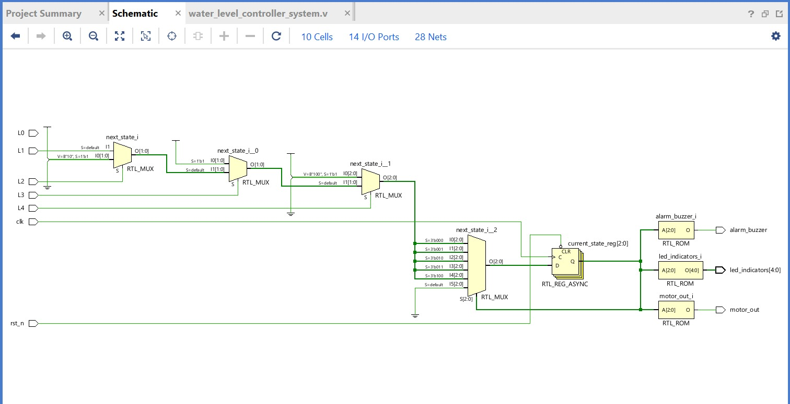
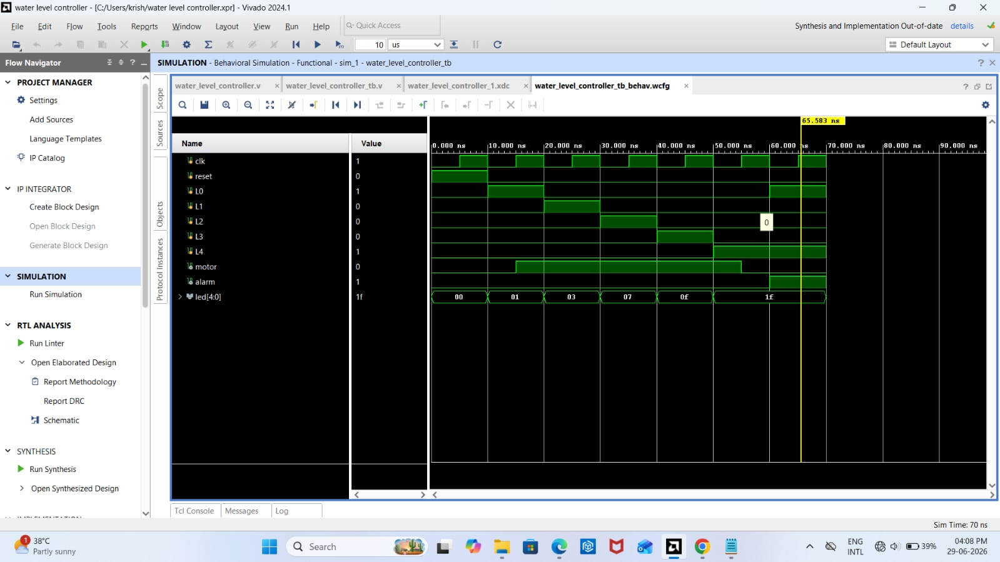
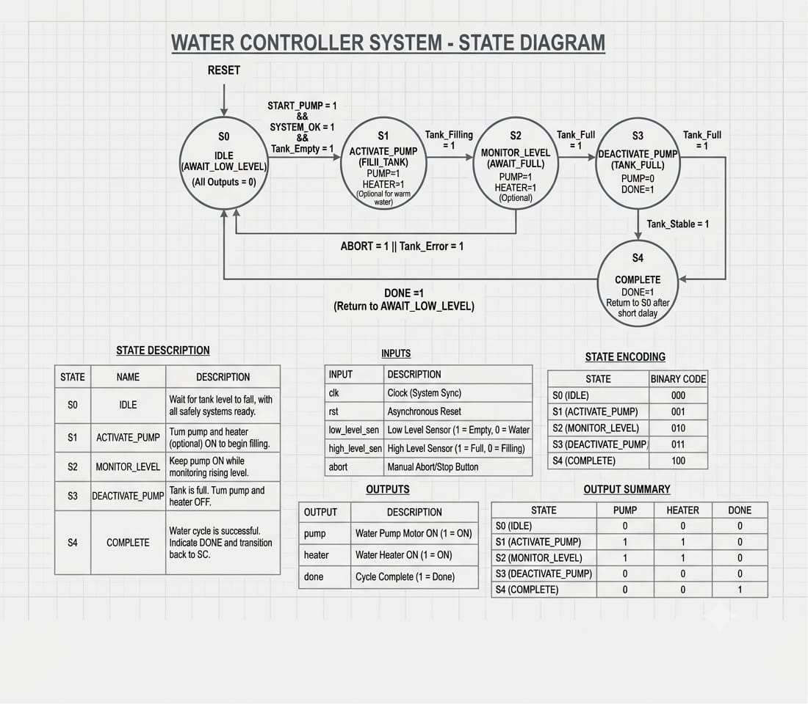
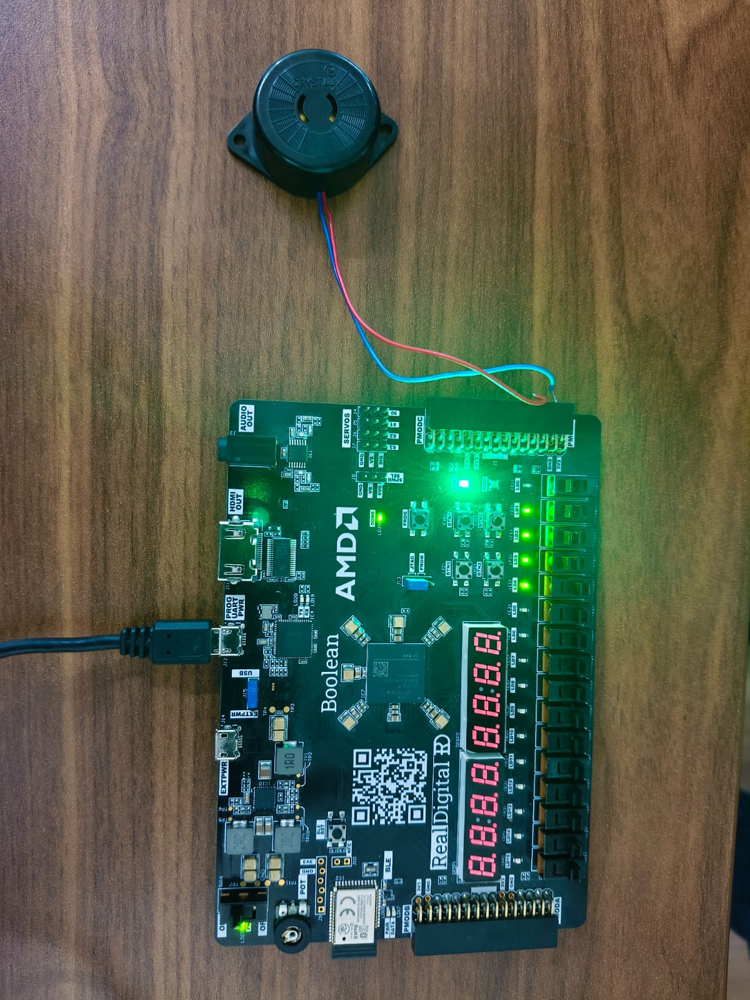
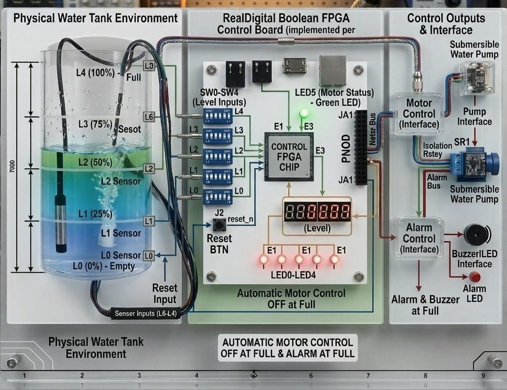

# FPGA Water Level Controller System using Verilog HDL


## Project Overview
This project implements a Water Level Controller System on the Spartan-7 FPGA Boolean Board using Verilog HDL. The controller monitors the water level using sensor inputs and automatically controls the water pump to prevent overflow and dry running.
## Features
- Automatic water level monitoring
- Automatic pump ON/OFF control
- Four water level indications (Empty, Low, Medium, Full)
- Verilog HDL implementation
- Spartan-7 FPGA based design
- RTL schematic and simulation

## Hardware
- Spartan-7 Boolean FPGA Board
- Water Level Sensors
- LEDs
- Water Pump (Simulation)

## Software
- AMD Vivado
- Verilog HDL
- Xilinx Simulator

## Project Structure
```
src/
testbench/
constraints/
images/
rtl/
simulation/
```

## Author
**Parag Kumar Tiwari**

ECE Undergraduate | Aspiring VLSI Engineer


---

## Project Layout



---

## RTL Schematic



---

## Simulation Waveform



---

## State Diagram



---

## FPGA Board



---

## FPGA Implementation


